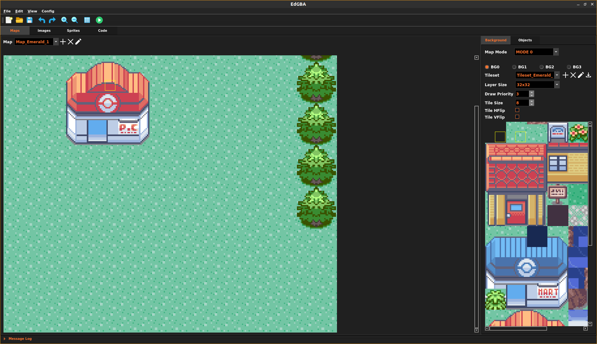

# EdGBA

**&#x26a0;&#xfe0f; Experimental Work-In-Progress**

An IDE for making Game Boy Advance games  

### Features
- Map, Sprite, and Code Editor
- Importing Tilesets and Spritesheets
- C Code generation
- Deploy and run 

### Getting Started
1. Grab latest release build
2. If you do not already have one, install an emulator. Below are some few good ones
    - [mGBA](https://mgba.io)
    - [VisualBoyAdvance](https://visualboyadvance.org/)
3. Setup the GBA Emulator from the Menu 
    - `Config->Set GBA Emulator` 
4. Check out the [example games](games/)   

### Development
#### Windows
1. Clone repo 
    - `https://github.com/138paulmiller/EdGBA.git`
2. Install Tools 
    - [Qt5](https://download.qt.io/official_releases/qtcreator/5.0/5.0.3/)

#### Debian/Ubuntu Linux
1. Clone repo
    - `git clone https://github.com/138paulmiller/EdGBA.git`
2. Install Tools 
    - `sudo apt-get install build-essential`
    - `sudo apt-get install qtcreator`
    - `wget https://download.qt.io/new_archive/qt/5.7/5.7.0/qt-opensource-linux-x64-5.7.0.run`
    - `chmod +x qt-opensource-linux-x64-5.7.0.run ./qt-opensource-linux-x64-5.7.0.run`

### Thanks
- [Tonc](https://www.coranac.com/tonc/text/toc.htm)
- [GBATEK](https://problemkaputt.de/gbatek.htm) 
